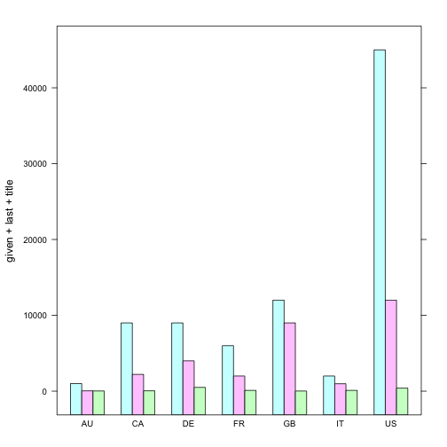

```

<div id = 'Items per Country' class = 'rChart polycharts'></div>
<script type='text/javascript'>
    var chartParams = {
 "dom": "Items per Country",
"width":    800,
"height":    400,
"layers": [
 {
 "x": "country",
"y": "items",
"data": {
 "country": [ "DE", "FR", "GB", "US", "IT", "AU", "CA" ],
"items": [  25000,  17500,  23000,  98000,  17000,   6250,  12900 ] 
},
"facet": null,
"color": "country",
"type": "bar" 
} 
],
"facet": [],
"guides": [],
"coord": [],
"id": "Items per Country" 
}
    _.each(chartParams.layers, function(el){
        el.data = polyjs.data(el.data)
    })
    var graph_Items per Country = polyjs.chart(chartParams);
</script>
```

charts
========================================================
author: Michael Sebald
date: 

Using Lattice
========================================================


```r
p_lattice <- barchart(given + last + title ~ country, data = df_countries)
plot(p_lattice)
```



Using rCharts
========================================================


```r
p_countries <- mPlot(x = "country", y = list("items", "given", "last", "title"), data = df_countries, type = "Bar")
p_countries$save("graphics/p_countries.html", cdn = TRUE)
p_countries
```

```
<iframe src=' charts-figure/unnamed-chunk-3-1.html ' scrolling='no' frameBorder='0' seamless class='rChart morris ' id=iframe- chart267d1cd6ce47 ></iframe> <style>iframe.rChart{ width: 100%; height: 400px;}</style>
```

Using googleVis
========================================================


